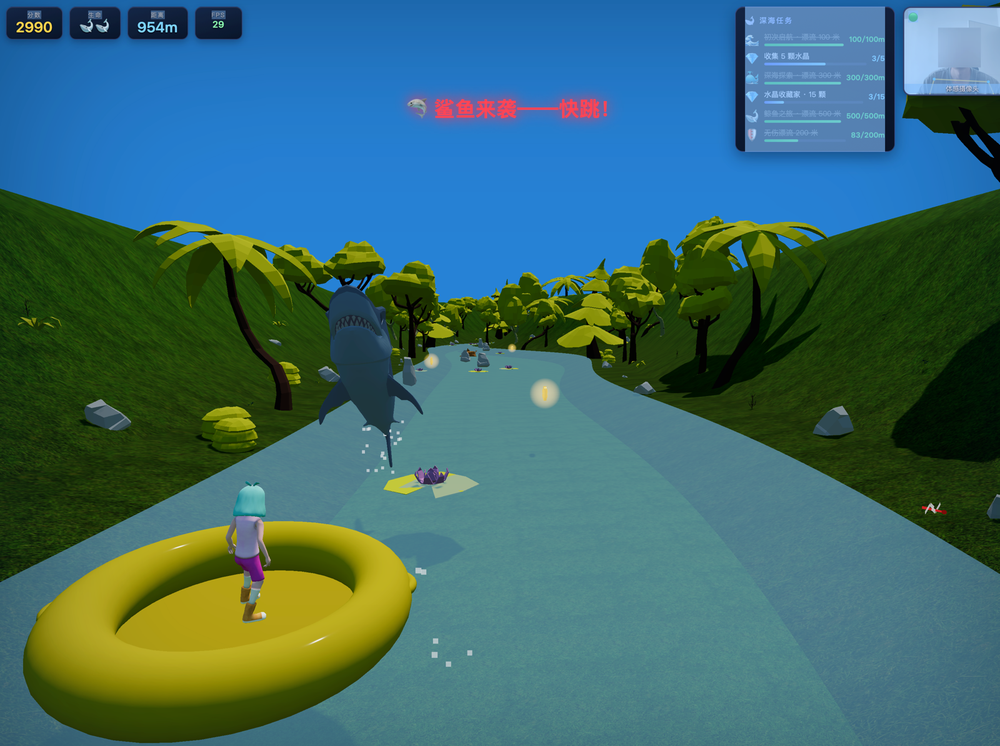

# 🚣 River Rush — 体感漂流大冒险

> 站在摄像头前，用身体控制木筏，闯过蜿蜒峡谷、俯冲瀑布、躲避鲨鱼，收集水下 $ 金币！



基于 **Three.js + MediaPipe Pose** 的单文件体感跑酷游戏。无需安装任何客户端——浏览器打开即玩，摄像头就是你的手柄。

---

## ✨ 特性

- **纯体感操控**：身体左右倾斜控制木筏，原地起跳越过障碍，手臂摆动触发特效
- **键盘同样可玩**：没有摄像头也能用键盘完整体验
- **瀑布俯冲镜头**：三段式运镜（俯瞰 → 落水仰拍水花 → 缓推拉回）
- **生态水世界**：鲨鱼跃出水面、蝠鲼群振翅滑翔、鱼群只在宽阔水域出没
- **收集与成长**：$ 浮雕金币（磁铁/护盾/冲刺/双倍四种道具）、QTE 事件慢动作
- **三档难度**：😌 简单 / 标准 / 🔥 困难（呼吸式节奏 + 提速），自动记忆选择
- **性能优化**：GPU 委托体感推理、粒子对象池、隔帧法线更新，中端设备稳定 60 帧

## 🎮 如何游戏

### 体感模式（推荐）

| 动作 | 游戏行为 |
|------|----------|
| 身体左倾 / 右倾 | 木筏左移 / 右移 |
| 原地起跳 | 木筏跃起（可跳过障碍、接高处金币） |
| 站在画面中央 | 保持平衡 |

允许摄像头权限后，右下角出现 🟢 即表示追踪成功。

### 键盘模式

| 按键 | 行为 |
|------|------|
| `←` `→` 或 `A` `D` | 左右移动 |
| `空格` / `↑` / `W` | 跳跃 |

### 玩法要点

- 躲避**岩石**和**浮木**，撞上扣一条生命（❤️×3）
- 收集 **$ 金币**涨分，金币带光晕远远可见
- 道具：🧲 磁铁吸金币 · 🛡️ 护盾挡一次 · ⚡ 冲刺加速 · 💰 双倍分数
- 难度按钮在开始界面，选择会保存在浏览器里

## 🚀 部署

项目是**纯静态单页**，任何静态文件服务器都能跑。

### 本地运行（30 秒上手）

```bash
git clone https://github.com/dudd/river-rush.git
cd river-rush
python3 -m http.server 8848
# 浏览器打开 http://localhost:8848/river-rush-pro.html
```

### 摄像头的限制（重要）

浏览器的 `getUserMedia` **只允许安全上下文**：

- `http://localhost` / `http://127.0.0.1` ✅ 直接可用
- 局域网 IP / 公网 HTTP ❌ 摄像头会被浏览器静默禁用（游戏自动回退键盘模式）
- 部署到公网或局域网手机体验 → 需要 **HTTPS**（自签名证书或 Caddy/Certbot），例如：

```bash
cd river-rush
openssl req -x509 -newkey rsa:2048 -nodes -keyout key.pem -out cert.pem -days 365 -subj "/CN=river-rush"
python3 -m http.server 8848 --certfile cert.pem --keyfile key.pem
```

### 云端托管

`vercel` / `Netlify` / `GitHub Pages` / `Cloudflare Pages` 均可直接部署（GitHub Pages 天然 HTTPS，摄像头可用）：

```bash
npm i -g vercel && vercel --prod
```

## 📦 依赖

**运行时零构建、零安装**，全部通过 CDN importmap 加载：

| 依赖 | 版本 | 用途 | 许可 |
|------|------|------|------|
| [three.js](https://threejs.org) | 0.160 | 3D 渲染 / 后处理 | MIT |
| [@mediapipe/pose](https://developers.google.com/mediapipe) | 0.5 | 人体姿态识别（GPU 推理） | Apache 2.0 |
| 浏览器 | Chrome/Edge ≥ 113、Firefox ≥ 115 | WebGL2 + WebRTC + WASM | — |

硬件建议：任何支持 WebGL2 的独显/核显；摄像头 720p 以上体验最佳（640×480 亦可）。

## 📁 项目结构

```
river-rush/
├── river-rush-pro.html   # 游戏本体（单文件，含全部逻辑）
├── assets/
│   ├── audio/            # 背景音乐与环境音
│   ├── models/
│   │   ├── animations/   # 角色动画 FBX（Idle / StandingJump）
│   │   ├── fish/         # 蝠鲼、Fish3 等 FBX
│   │   └── pirate/       # 鲨鱼 / 金枪鱼 / 鲭鱼 GLTF（Quaternius）
│   └── textures/         # 树皮 / 地面贴图
└── README.md
```

## 🛠️ 技术要点（给想改代码的你）

- **体感管线**：MediaPipe Pose（GPU delegate）→ 髋中点平滑 → 木筏横移；髋部上冲检测起跳
- **蒙皮模型烘焙**：部分 FBX 骨骼绑定与运行时姿态不一致（蒙皮顶点会爆炸到 1e+300），加载时统一烘焙为静态网格 + 程序动画补偿（振翅/摆尾）
- **河流参数化**：`riverCenterX / riverHalfWidth / waterfallY` 三个纯函数驱动水面、河床、地形、相机、生成点——改河道形状只动这三处
- **性能守则**：顶点位置每帧更新、法线隔帧重算；粒子对象池；DOM 写入带变更守卫；体感推理走 GPU 委托避免主线程阻塞

## 📄 许可与致谢

- 代码：[MIT](LICENSE)
- 角色/鱼类/道具模型：[Quaternius](https://quaternius.com)（CC0）
- 角色动画：[Mixamo](https://www.mixamo.com)
- 姿态识别：Google MediaPipe（Apache 2.0）

---

*用 ❤️ 和 DeepSeek 打造*
